# Smart Parking IoT System 🚗💨

A modern, automated parking management system designed to reduce manual operation and provide real-time data insights using IoT technology.

---

## 🚀 Key Features

* **Real-time Monitoring:** Tracks parking slot occupancy using ultrasonic sensors with instant web dashboard updates.
* **Automated LPR (License Plate Recognition):** Uses **ESP32-CAM** to capture vehicle license plates and processes them via an AI API for entry/exit logging.
* **Driver Self-Service:** Allows drivers to check their current parking duration and estimated fees instantly via the web.
* **Paperless System:** Completely removes the need for physical tickets or plastic cards by using license plates as the unique identifier.
* **Dynamic Billing:** Automatically calculates parking duration and fees via Google Cloud Functions.
* **Admin Dashboard:** Provides real-time revenue tracking, peak-time analytics, and historical parking logs for management.

---
## 🏗 System Architecture

The system operates across three main layers:
1.  **Edge Node Layer:** Manages sensors, gate control, and local LCD display feedback via **ESP-NOW** for low latency.
2.  **Cloud Layer:** Orchestrates data storage, LPR image processing, and billing logic.
3.  **Application Layer:** A responsive Web Dashboard for parking administrators to monitor status and analytics.

---

## 🛠 Tech Stack

| Layer | Technologies |
| :--- | :--- |
| **Edge Hardware** | ESP32, ESP32-CAM, Ultrasonic Sensors (HC-SR04), Servo Motors |
| **Communication** | ESP-NOW (Local), MQTT (Broker: HiveMQ), HTTPS/JSON |
| **Backend/Cloud** | Google Firebase (Real-time DB, Firestore, Storage, Cloud Functions) |
| **AI/Vision** | OpenCV, AI for Thai (LPR API) |
| **Frontend** | HTML5, JavaScript, Chart.js, Bootstrap |

---

## 🎥 Operational Showcase

> **System Demonstration**
> 
> Watch our automated parking system in action. This video covers the end-to-end workflow: from vehicle entry detection and AI-based license plate recognition, to the real-time billing calculation and automated gate control during exit.
>
> **[▶ Click here to watch the full project demo on YouTube](YOUR_YOUTUBE_URL)**

---

## 🖼 Project Gallery

Here is an overview of the hardware components and the final assembly of the Smart Parking system.

  <table border="0" width="100%">
    <tr>
      <td>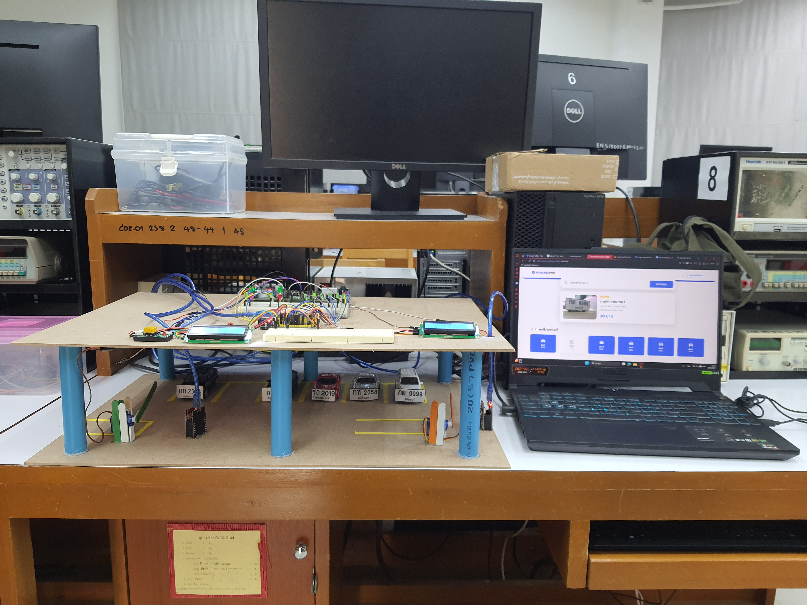</td>
      <td>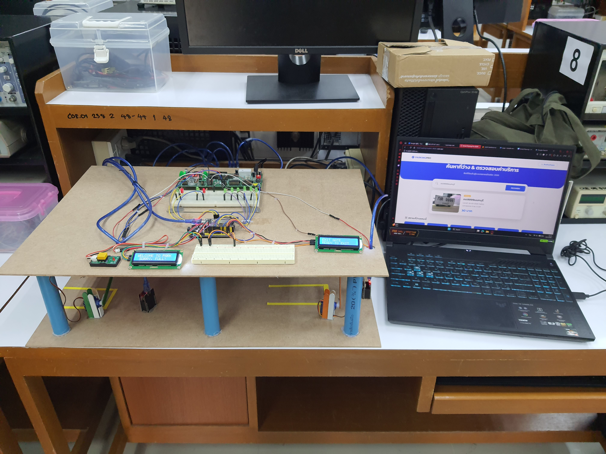</td>
      <td></td>      
    </tr>
    <tr>
      <td></td>    
      <td>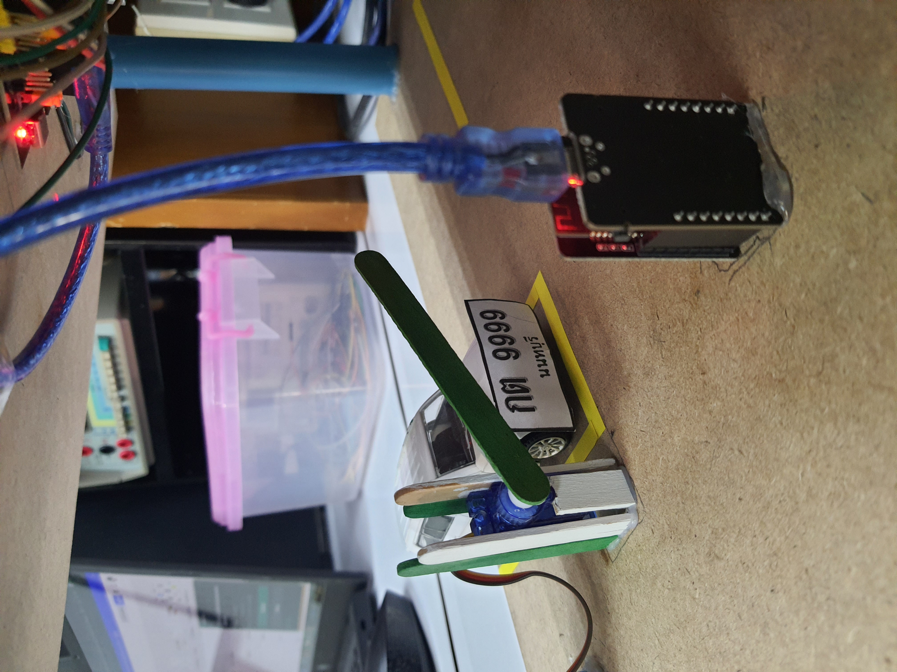</td>
      <td>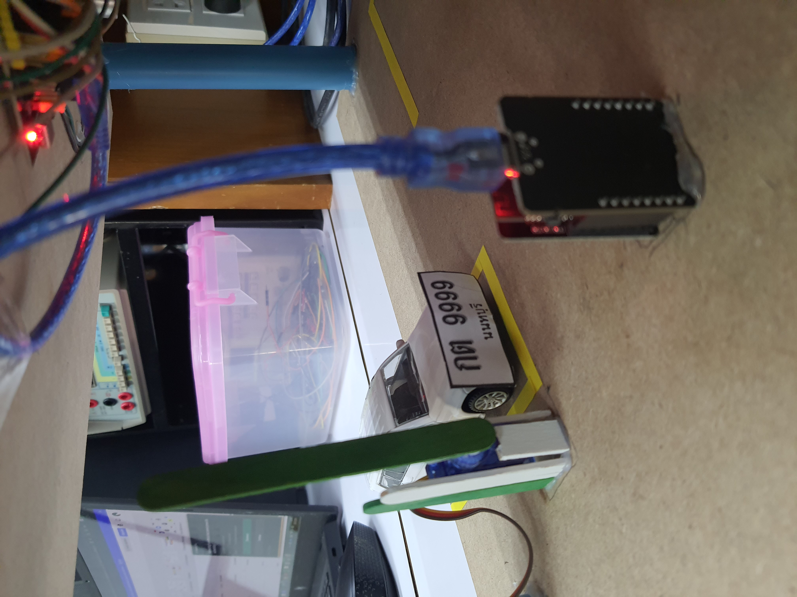</td>
    </tr>
    <tr>
      <td>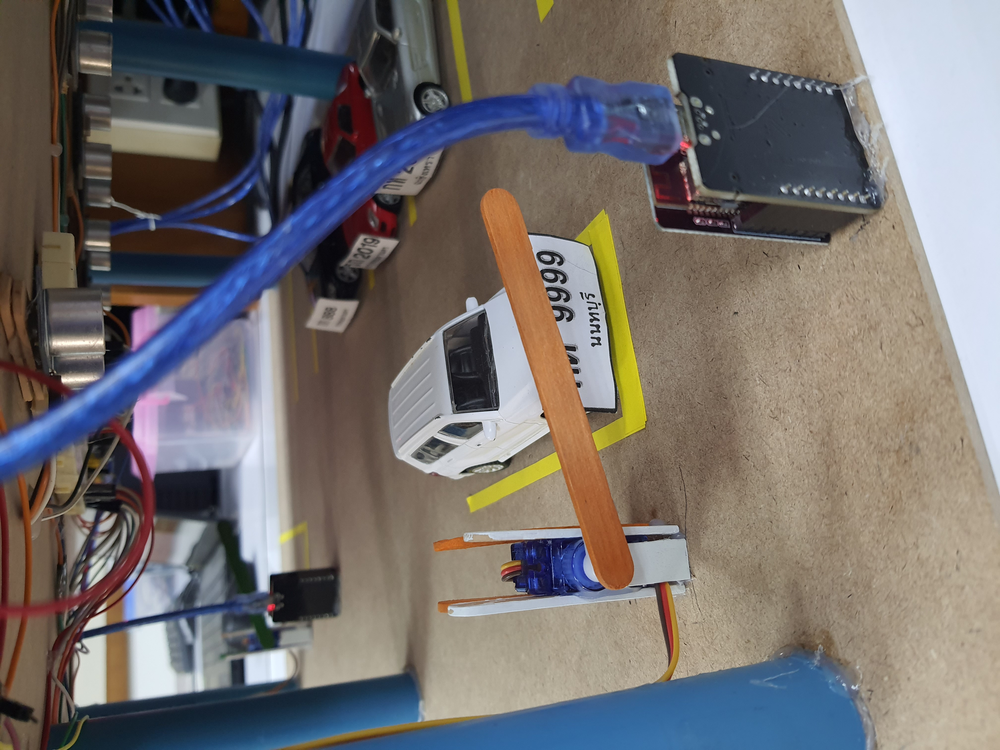</td>
      <td>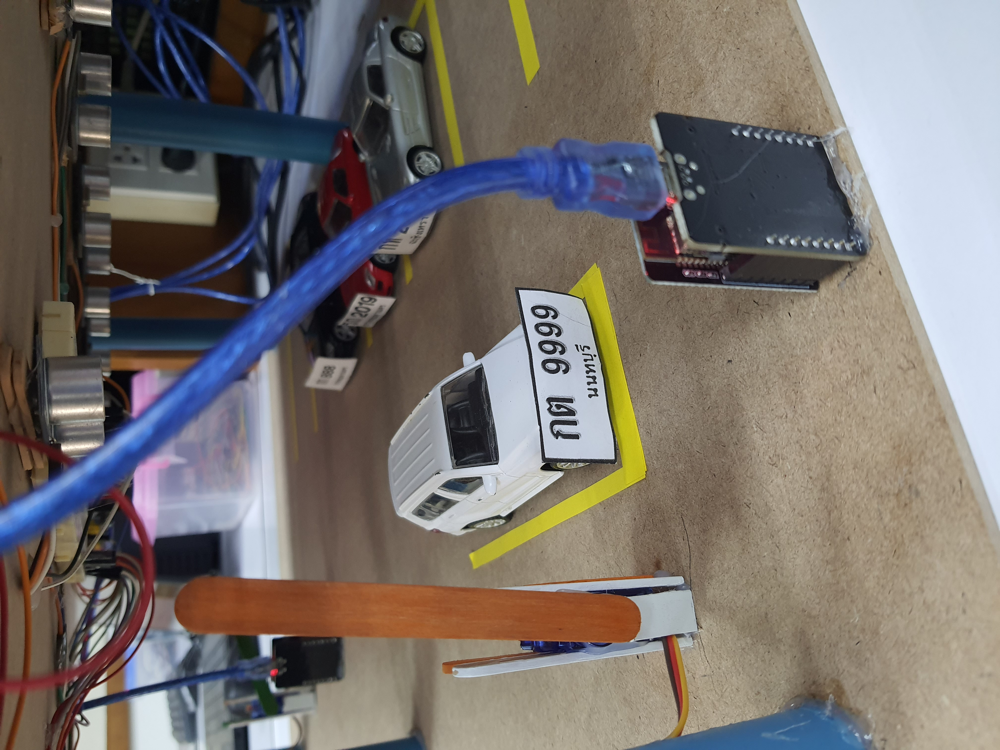</td>
      <td>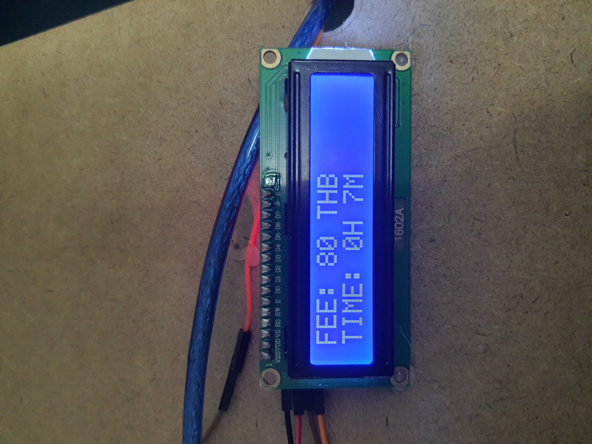</td>
    </tr>
    <tr>
      <td>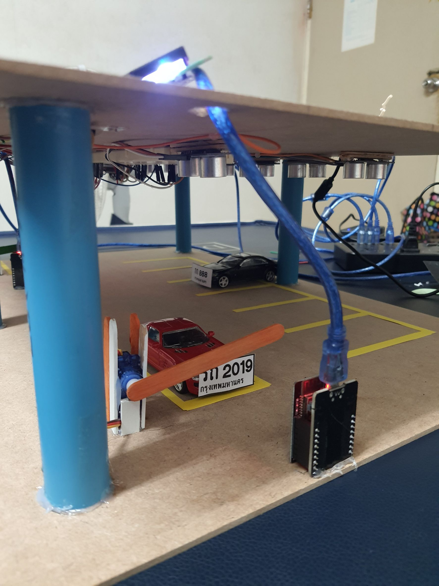</td>
      <td>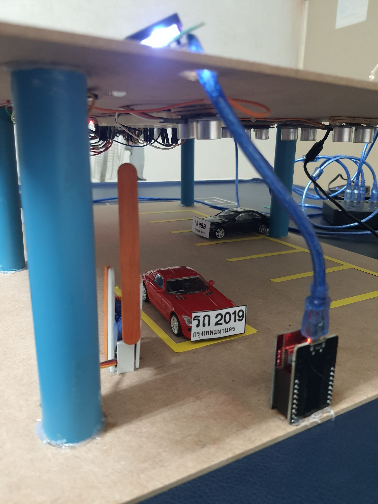</td>
      <td>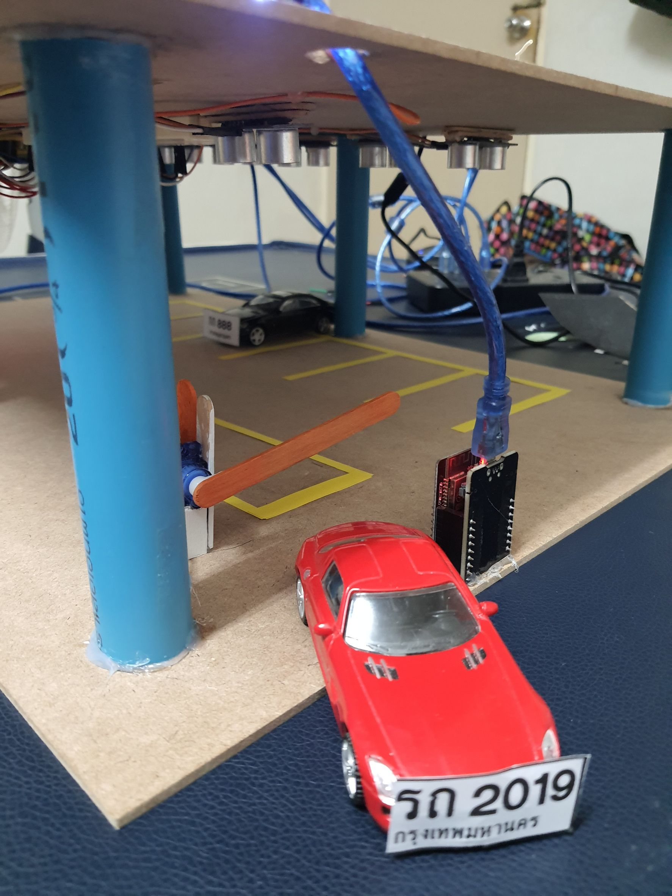</td>
    </tr>
  </table>

---

## 📊 Dashboard & Monitoring

The system provides a responsive web dashboard designed for both everyday users and administrators to monitor parking operations seamlessly.

### 🌟 Core Features

| Feature | Description | Preview |
| :--- | :--- | :--- |
| **Slot Status** | Live updates when a vehicle enters or exits any parking space. | 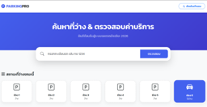 |
| **User Search** | Enter a license plate to view vehicle status, entry photo, and current billing. | 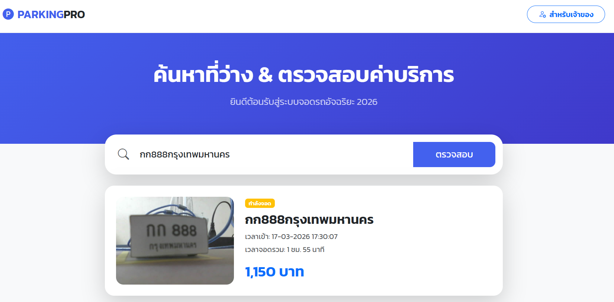 |
| **Logs** | Tracks vehicle entry and exit history for administrative oversight. | 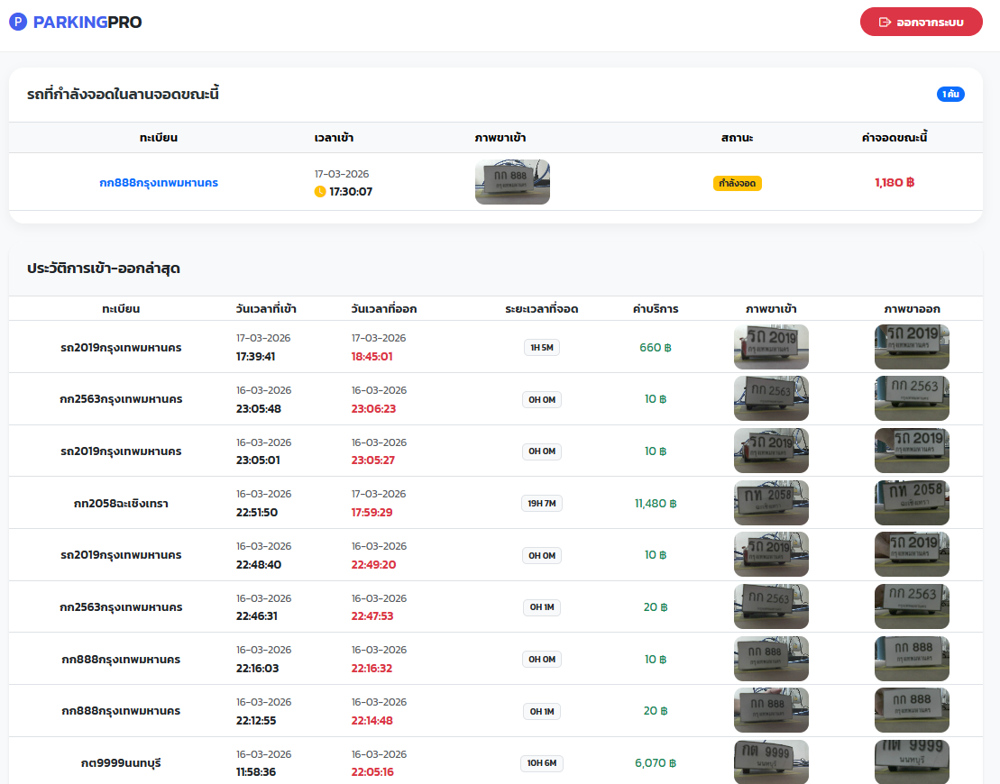 |
| **Analytics** | Comprehensive revenue charts, peak-time graphs, and parking duration statistics. | 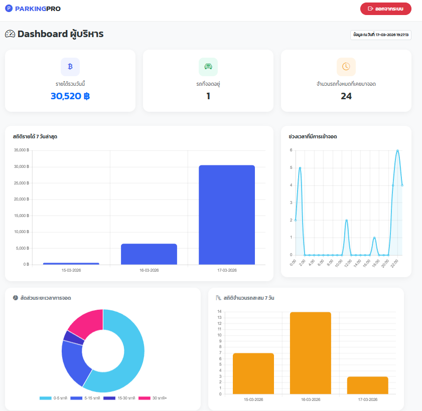 |

### ⚡ Real-Time Synchronization (Latency Test)

To ensure a seamless experience, we conducted speed tests for data synchronization between the physical ultrasonic sensors and the web interface. The system guarantees near real-time updates:

  <table width="100%">
    <tr>
      <th width="20%">Status Indicator</th>
      <th width="30%">Before Parking (Slot 6)</th>
      <th width="30%">After Parking (Slot 6)</th>
      <th width="20%">Update Latency</th>
    </tr>
    <tr>
      <td><b>Physical LED</b></td>
      <td>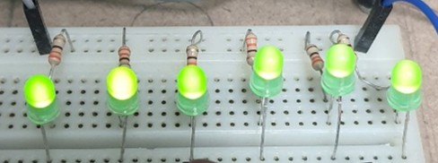</td>
      <td>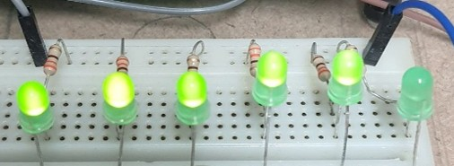</td>
      <td align="center">Within 3 Seconds</td>
    </tr>
    <tr>
      <td><b>Web Dashboard</b></td>
      <td>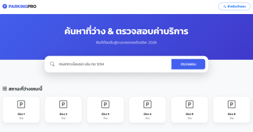</td>
      <td></td>
      <td align="center">Within 10 Seconds</td>
    </tr>
  </table>

---

## ⚠️ System Reliability & Challenges

While the system successfully meets all project objectives, we identified several stability challenges during continuous testing:

1. **Servo Motor Instability:** The gate mechanism occasionally malfunctions due to voltage drops when multiple sensors are active, as well as heat accumulation in the motor.
2. **ESP32-CAM Connectivity:** The exit camera unit frequently times out during long idle periods due to power management limitations and Wi-Fi signal distance.
3. **Network Latency:** System responsiveness (gate opening speed) is heavily dependent on internet stability. High latency significantly delays the gate response.

---

## 💡 Future Enhancements

To take this project to the next level, the following improvements are recommended:

* **Pre-booking System:** Develop a feature allowing users to reserve parking slots in advance, marking them as "Reserved" (yellow) on the dashboard.
* **Online Payment Integration:** Integrate payment gateways like PromptPay or Mobile Banking to enable fully automated, cashless transactions.
* **Edge Computing Migration:** Implement on-device AI processing (e.g., using a more powerful board like Raspberry Pi) to reduce latency and dependence on constant internet connectivity.
* **Line Notify Integration:** Add automated notifications to alert admins via LINE when vehicles enter/exit or when system errors occur.
* **Adaptive Lighting:** Install intelligent LED lighting that activates only when a vehicle is detected, assisting ESP32-CAM in low-light conditions.